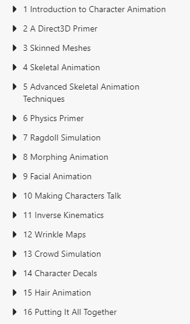
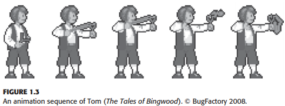
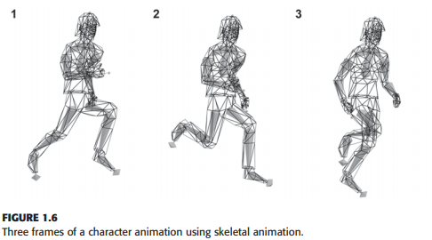
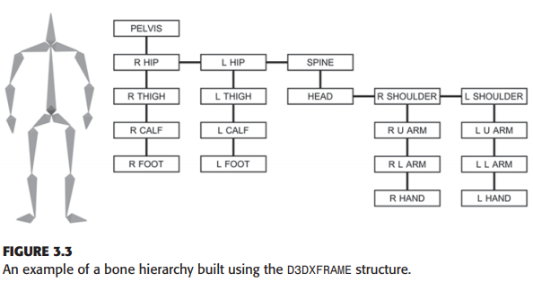
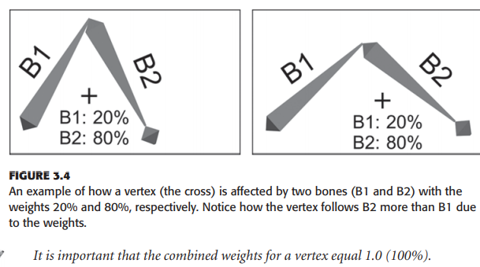

# 1 Introduction to Character Animation

# 2 A Direct3D Primer

DirectX 9 太过时了，简单了解。

可以用 DirextX 12 搭建 VisualStudio 的开发环境。

* 创建窗口
* 加载 StaticMesh

# 3 Skinned Meshes

## 骨架树对应到 StaticMesh 上

DirectX 加载骨架树，将 Mesh 应用到骨架树

## Software Skinning 使用 CPU 蒙皮

With software  skinning, it also doesn’t matter how many bones are influencing a vertex. 使用 CPU 蒙皮，一个骨骼可以影响任意数量的顶点。

 If you were making a first-person shooter (FPS) game, you might want to test to see whether or not a bullet you fired hit one of the enemy soldiers. With software  skinning, this would be easy to test using a simple mesh–ray intersection test. 碰撞检测查询也更加容易

## Hardware Skinning 使用 GPU 蒙皮

With hardware skinning, you can, of course, also do shadow casting, picking, etc., but then it requires a little more effort to get it to work. Hardware skinning also has some limits as to how many bones can influence a vertex as well as how many bones you can have per character without having to split up the mesh into several parts.  也能计算阴影，但是单个骨骼能影响的顶点数量有限制。

## 代码实现 Software Skinning，实现 HardWare Skinning

# 4 Skeletal Animation

# 5 Advanced Skeletal Animation Techniques

# 6 Physics Primer

# 7 Ragdoll Simulation

# 8 Morphing Animation

# 9  Facial Animation

# 10 Making Character Talk

# 11 Inverse Kinematics

# 12 Wrinkle Maps

# 13 Crowd Simulation

# 14 Character Decals

# 15 Hair Animation

# 16 Putting It All Together

## Atttaching the Head to the Body

