# Math Background: Vector, Matrix and Tensor Calculus

# Vectors 矢量

## **Vector: Definition**

印刷体区分，斜体是标量，黑体是矢量，大写黑体是矩阵。

右手坐标系：手掌从 x 到 y，大拇指指向 Z 方向。OpenGL，研究

左手坐标系：Unity，DirectX

Stacked Vector 没有几何含义，每个顶点都是一个向量

## **Vector Arithematic: Addition and Subtraction**

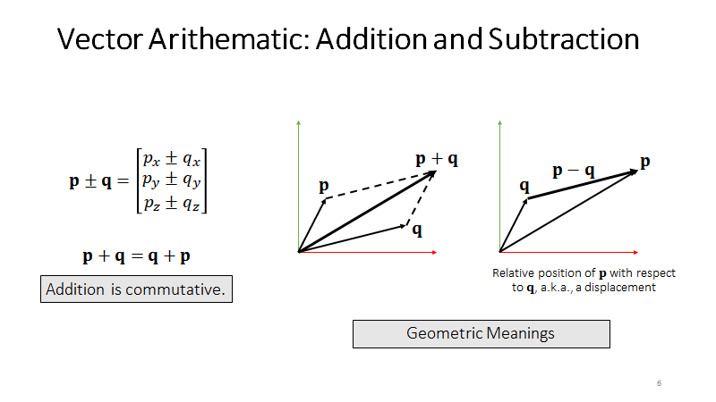

## **Vector Norm**

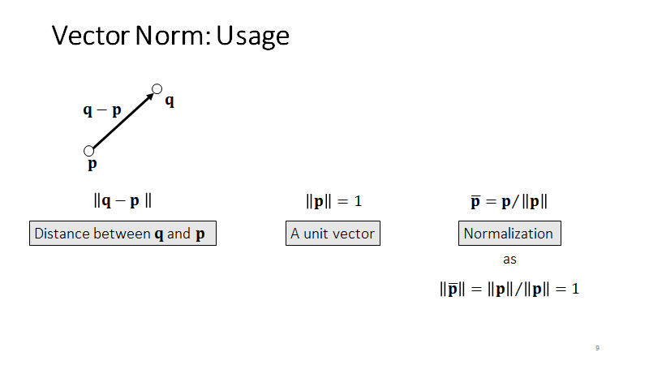

## **Vector Arithematic: Dot Product** 点乘

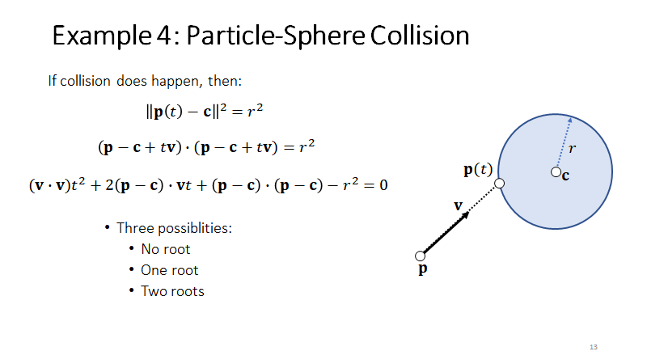

## **Vector Arithematic: Cross Product** 叉乘

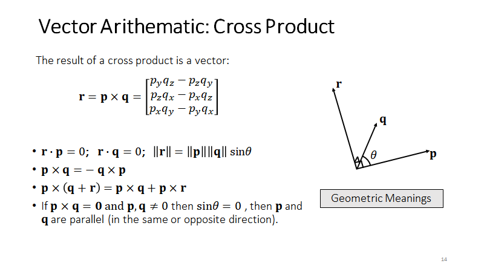

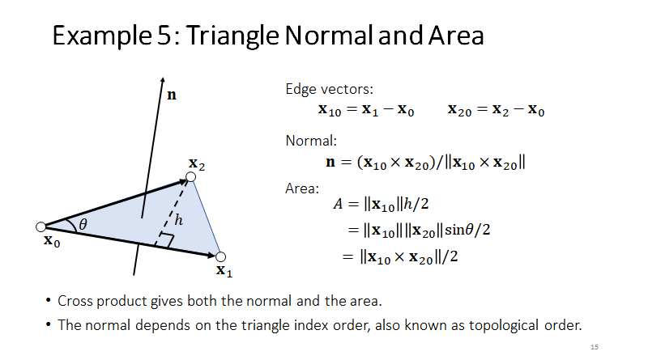

拓扑顺序很重要，否则会反向

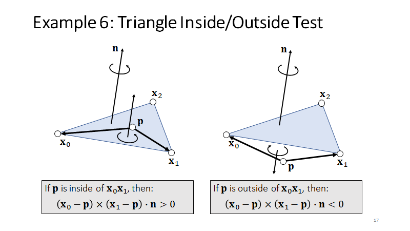

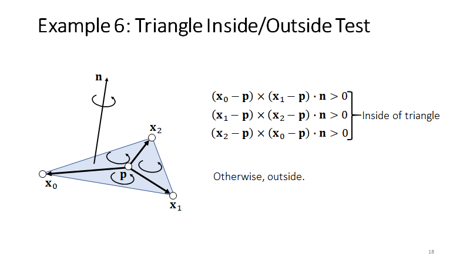

还有其它方法，重心坐标表示的判断应该更高效。

p 跑到外面去，就会出现负面积。利用重心权重，可以进行重心坐标插值。

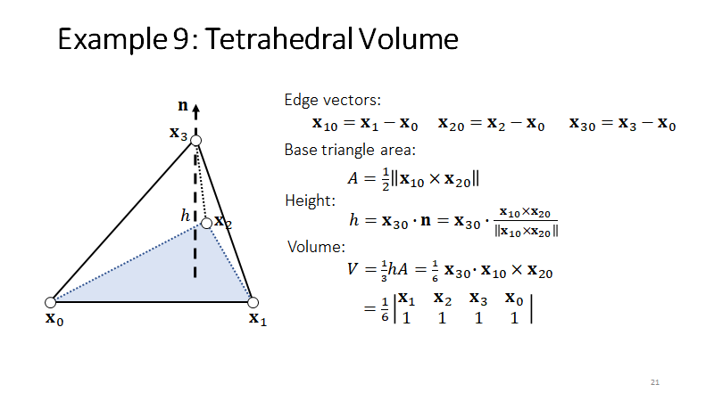

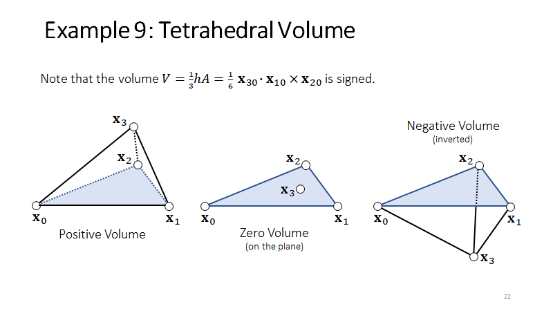

本质上和平面三角形的是一样的概念，多了一个点。

# **Matrices**

## **Matrix: Definition**

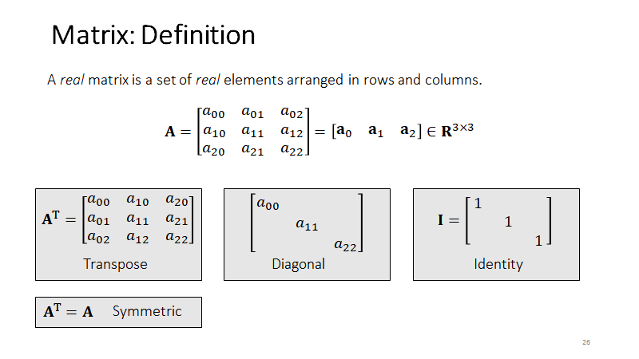

## **Matrix: Multiplication**

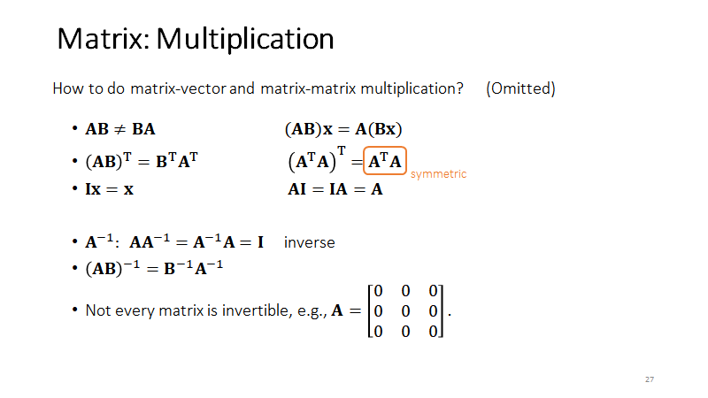

## **Matrix: Orthogonality**

## **Matrix Transformation**

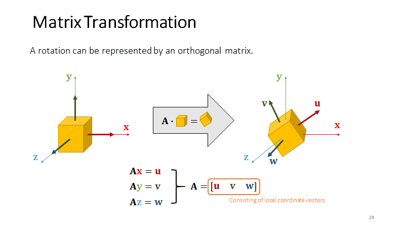

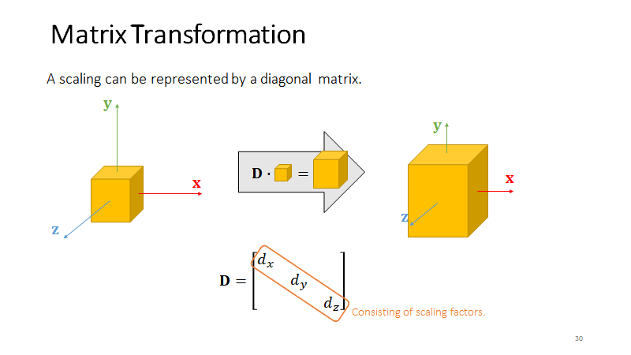

## **Singular Value Decomposition** 奇异值分解

线性变换，可以通过 `旋转-缩放-旋转 `得到

## **Eigenvalue Decomposition** 特征值分解

对称矩阵

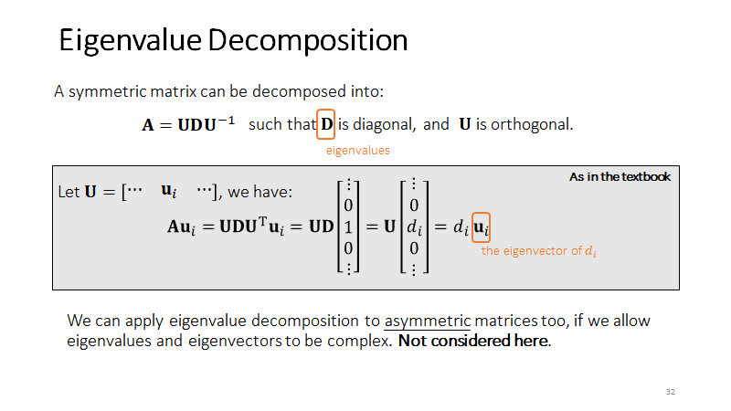

对称且正定

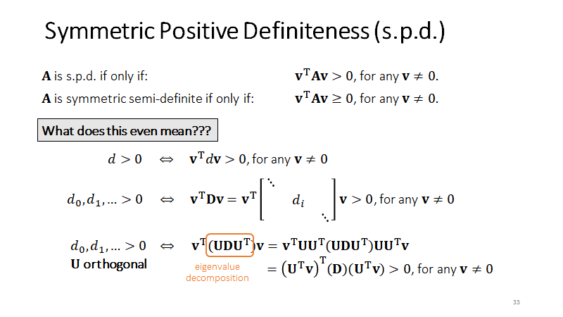

通过数值计算特征值分解是很慢的，实际使用。（没有概念有点懵）

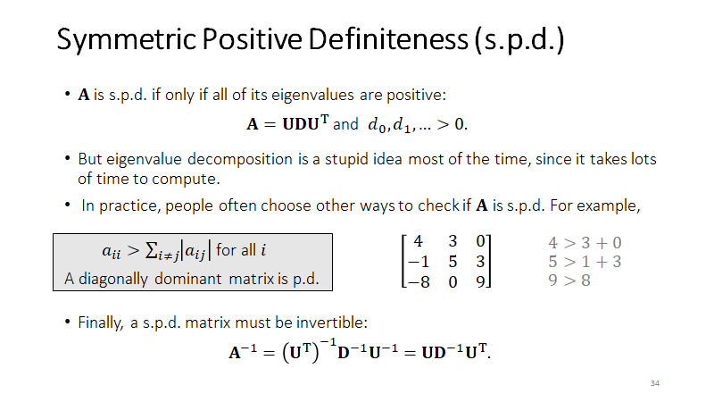

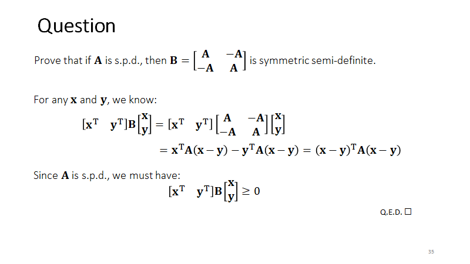

# **Linear Solver** 线性问题

很多数值问题最后就是解线性方程

不直接求逆，一般用直接法和迭代法

## **Direct Linear Solver**

LU 分解

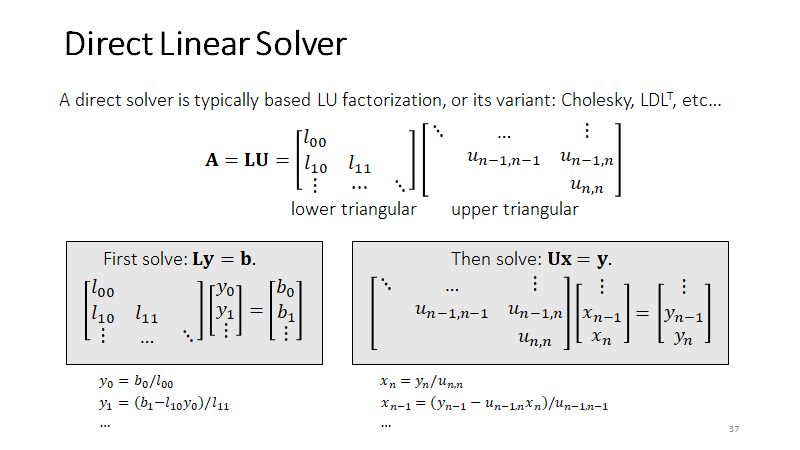

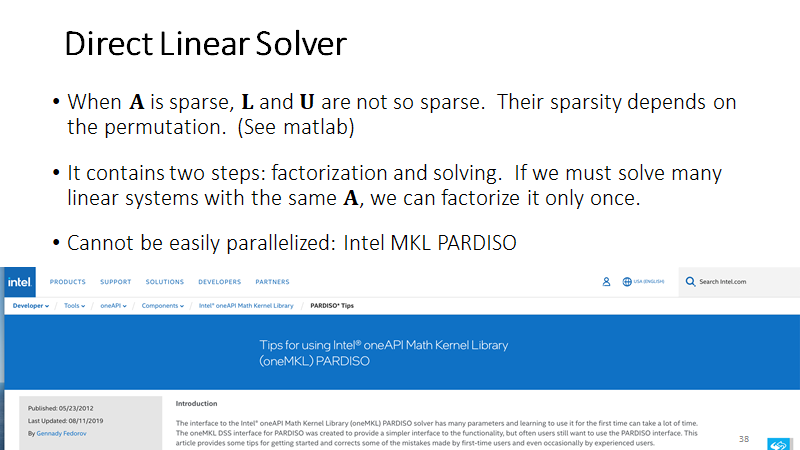

## **Iterative Linear Solver** 迭代法

数值分析

直接法可能要写几周，迭代法一天就够了。迭代法比较容易并行，缺点：收敛性问题。relaxation 手动调

# **Tensor Calculus**

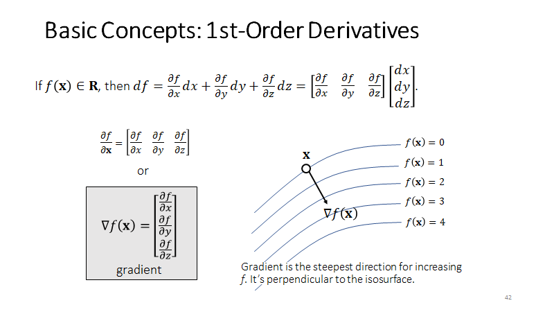

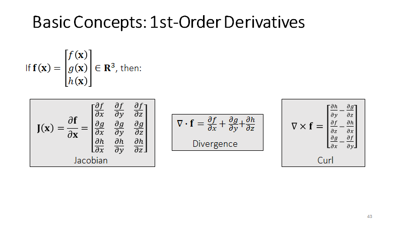

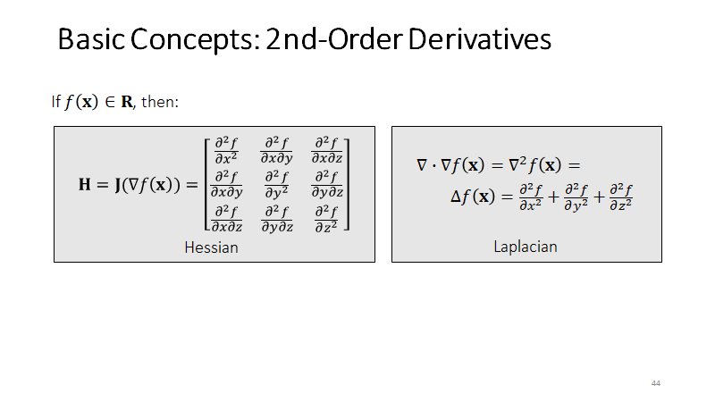

前面讲的正定，跟函数的二阶导数有关系

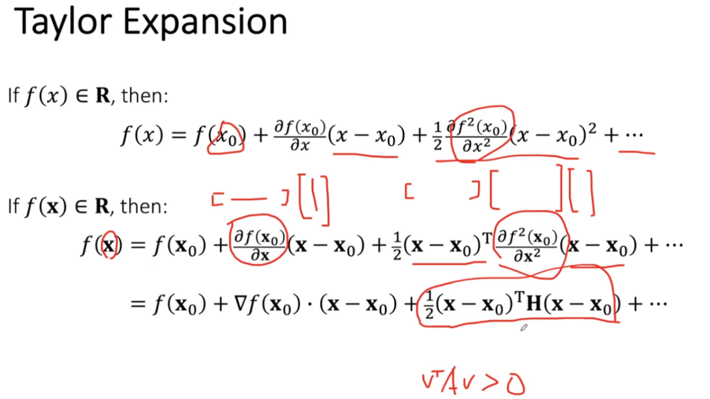

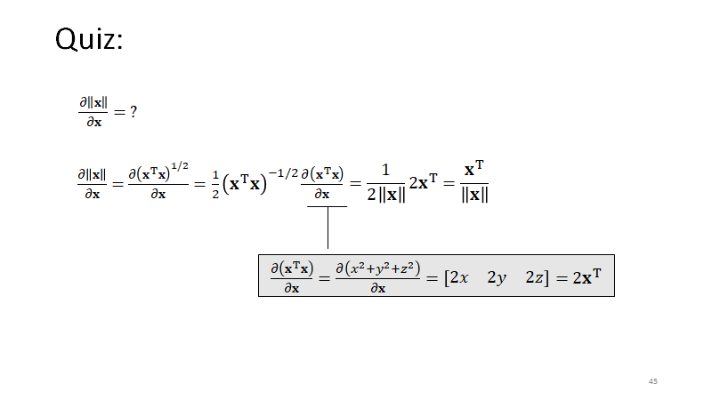

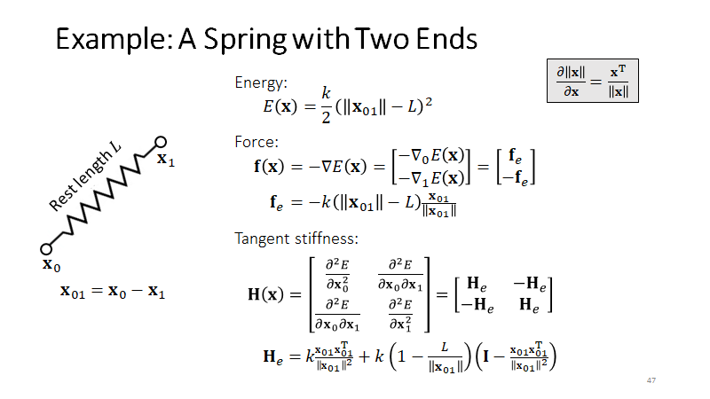

