# Physics-Based Cloth Simulation

弹簧质点系统：显示积分，隐式积分

弯曲问题

非弹簧的方式

# **A Mass Spring System**

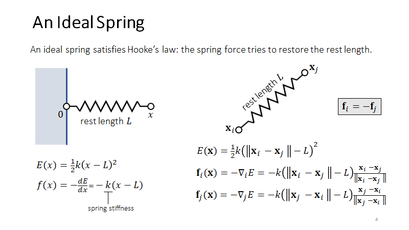

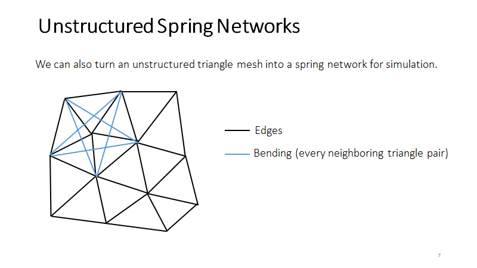

排序后，检测重复，并剔除内部边

# **Explicit Integration of A Mass-Spring System** 显式

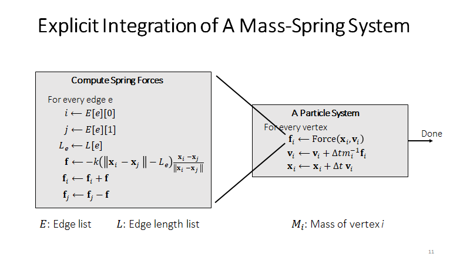

缺点：数值不稳定，K 很大或者 时间步长很大的时候。隐式积分通过误差衰减的方式来解决。

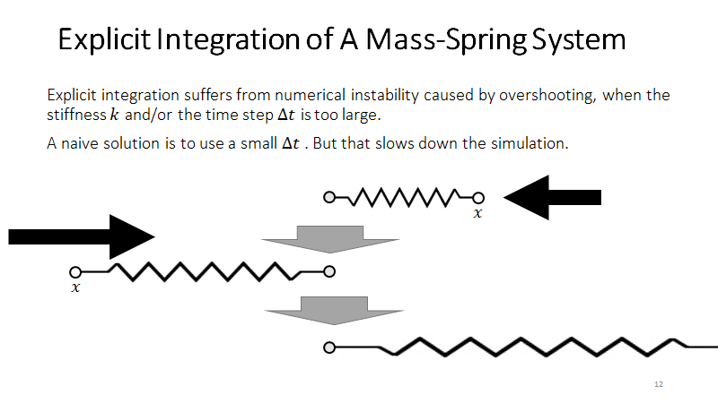

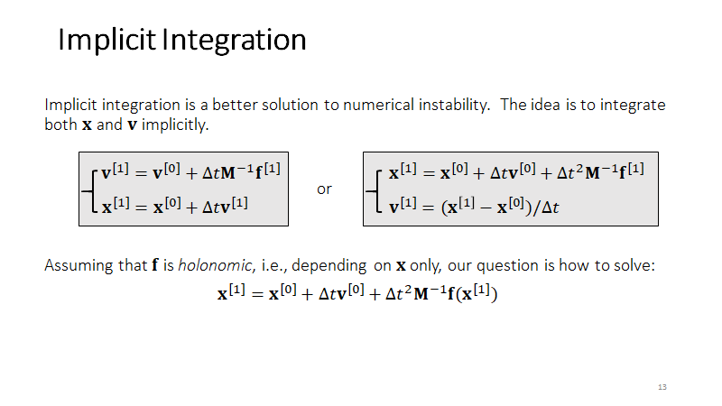

隐式积分，消元反推，只跟位置相关。力 f 可能不是线性的，转化为优化问题，利用已有的数值套路。采用了能量优化，而不是解放城组的方法。

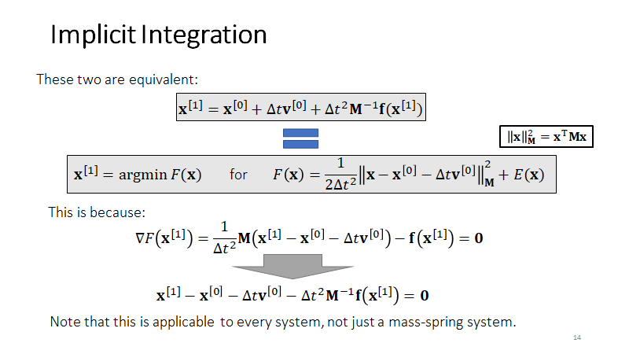

牛顿法，解非线性优化问题。牛顿法求根类似

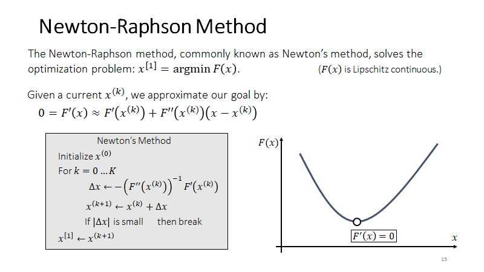

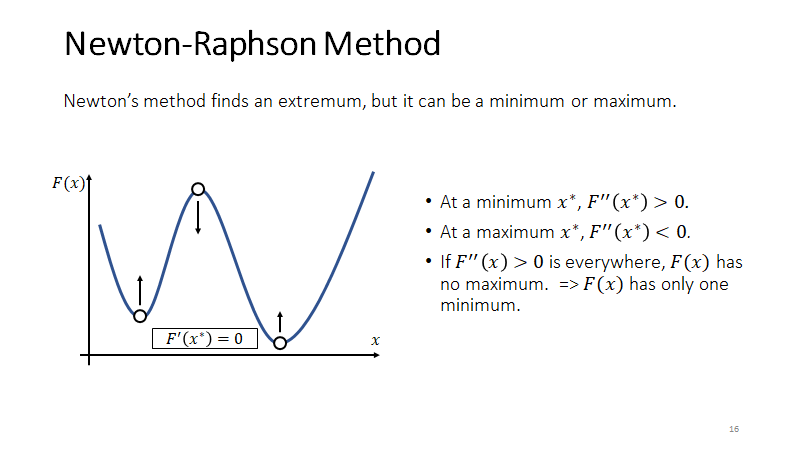

用二阶导数判定开口方向，确定是最大值还是最小值。只能达到局部最优，增加随机扰动。

二阶导数永远大于 0 的话，不存在最大值，就只有一个最小值。

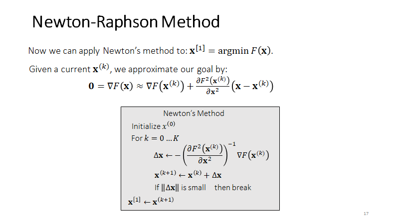

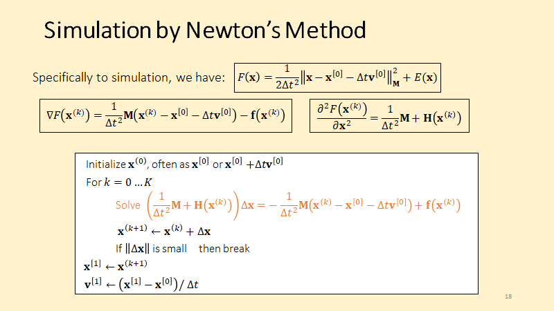

Hessian 二阶导数矩阵，类似拉普拉斯算子。为何讨论是否正定？实数函数如果二阶导数永远为正的话，存在唯一解。

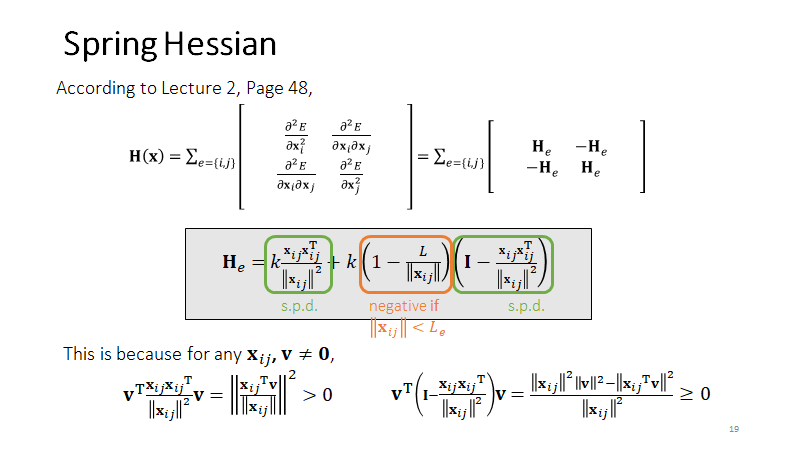

如果 Hessian 永远正定，就有唯一解。不正定的时候，未必没有唯一解。

充分不必要条件

拉伸的时候会稳定很多，压缩的时候容易出问题（非正定）。

压缩的时候非正定，因为不清楚会往哪边翘起。1D  没这个问题，2D 和 3D 有

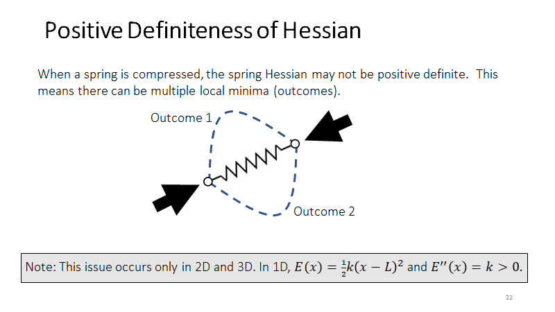

​	Choi and Ko. 2002. Stable But Responive Cloth. TOG (SIGGRAPH)

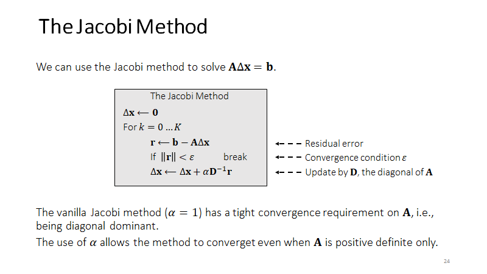

直接法和迭代法的区别，除了运算量还有内存量的问题。

等价于只做一次牛顿迭代

# **Bending and Locking Issues** 

二面角模型，拆成方向和大小

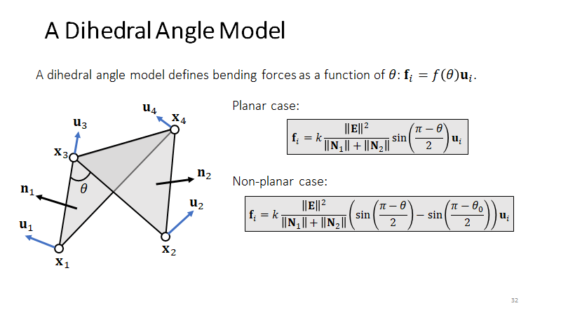

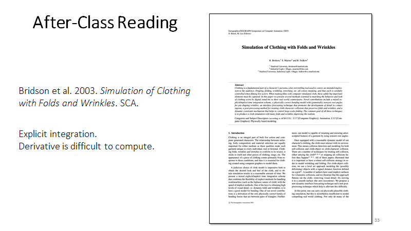

可以从头到尾读一下，比较有意思

# **A Quadratic Bending Model**

能量跟曲率有关，平的时候能量为 0。不是物理能量推导，数学拉普拉斯算子曲率。

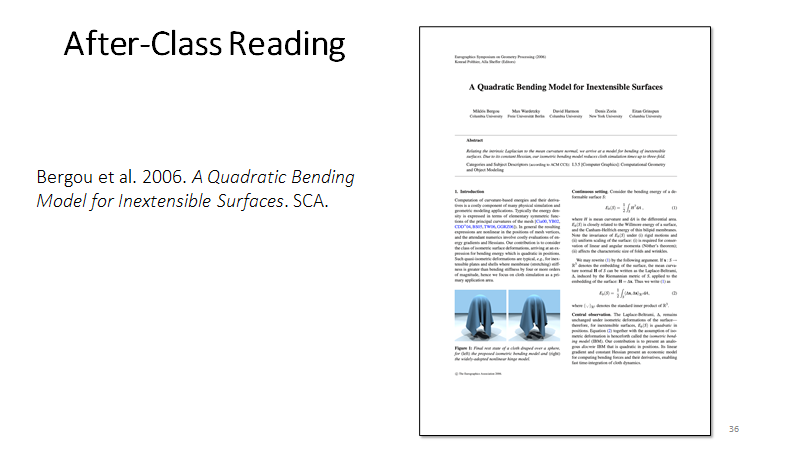

# **The Locking Issue**

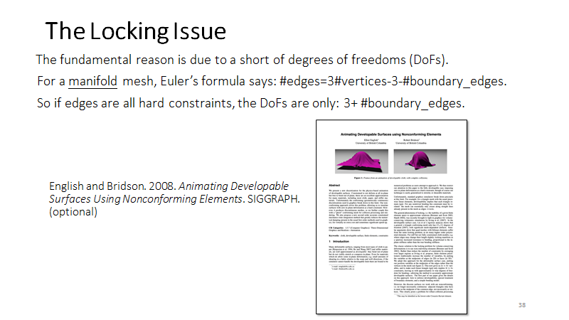

paper 把自由度定义到边上，更复杂了

# **Shape Matching**